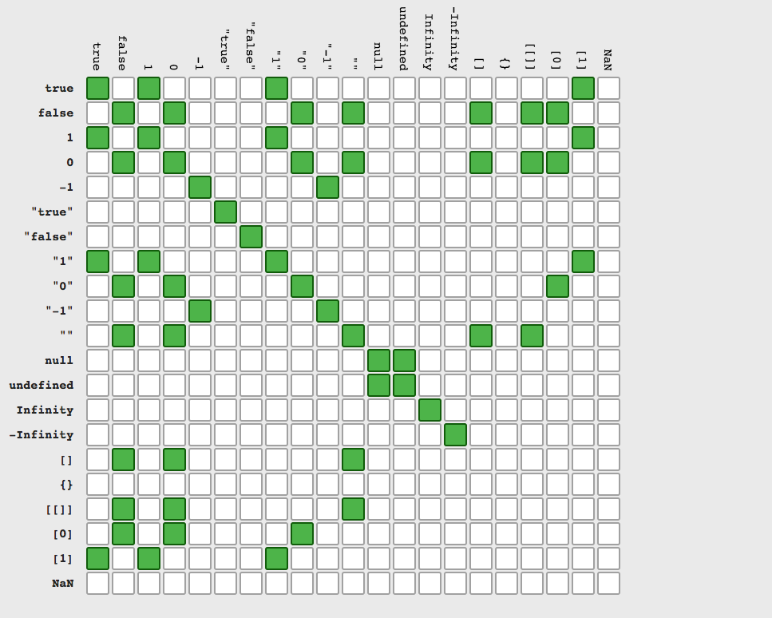

##1

```javascript
var big = 'so big'

var obj = {
  big: 'so so big',
  showBig: function() {
    return this.big
  }
}
obj.showBig.call(big)
```

<span style="color:green">答案:</span> ----ƒ big() { [native code] } String 自带 big 方法----

##2

```javascript
console.log(1 / 0)
```

<span style="color:green">答案:</span> --------Infinity

<span style="color:#EA6F5A">解析:</span> 比 0 大的数除以 0，则会得到无穷大，所以 js 用 Infinity 来显示出来

##3

```javascript
function foo() {
  let i = 1
  return function() {
    console.log(i)
  }
}
let bar = foo()
foo()
```

<span style="color:green">答案:</span>  加长一点-------1

<span style="color:#EA6F5A">解析:</span> 闭包啊啊啊啊啊啊啊啊

##4

```javascript
function foo() {
  console.log(a)
  var a = 1
  function a() {}
  var a = 123
  console.log(a)
}
foo()
```

<span style="color:green">答案:</span> [Function: a]和 123

<span style="color:#EA6F5A">解析:</span> 变量提升

##4

```javascript
//nodejs中
{
  var a = (b = [])
}

console.log(a, b, global.a, global.b)
```

<span style="color:green">答案:</span> [ ][ ] undefined [ ]

<span style="color:#EA6F5A">解析:</span> var a =[ ]； b=[ ]-->global.b

##5

```javascript
var f = function g() {
  return 23
}
typeof g
```

<span style="color:green">答案:</span> !!undefined!!

<span style="color:#EA6F5A">解析:</span> 
https://www.w3.org/html/ig/zh/wiki/ES5/functions


##6

```javascript
;(function() {
  console.log(Object.prototype.toString.call(arguments))
  console.log(arguments.isArray())
})()
```

<span style="color:green">答案:</span> [object Arguments],arguments.isArray is not a function

<span style="color:#EA6F5A">解析:</span> 
arguments 对象是所有（非箭头）函数中都可用的局部变量
arguments 对象不是一个 Array 。它类似于 Array，但除了 length 属性和索引元素之外没有任何 Array 属性。例如，它没有 pop 方法。但是它可以被转换为一个真正的 Array


##7

```javascript
var foo = {
  bar: function() {
    console.log(`---`, this.baz)
    return this.baz
  },
  baz: 1
}
var f1 = foo.bar
f1()
```

<span style="color:green">答案:</span> --- udf

<span style="color:#EA6F5A">解析:</span> 
var f1 = foo.bar 返回的就是 bar 的值，而不是其引用，那么 this 也就指的不是 foo 了


##8

```javascript
function f() {
  return f
}
new f() instanceof f
```

<span style="color:green">答案:</span> --- false ---

<span style="color:#EA6F5A">解析:</span> 
当代码 new f()执行时，下面事情将会发生： <br>
1:一个新对象被创建。它继承自 f.prototype <br>
2:构造函数 f 被执行。执行的时候，相应的传参会被传入，同时上下文(this)会被指定为这个新实例。 <br> new f 等同于 new f()，只能用在不传递任何参数的情况。 <br>
3:如果构造函数返回了一个“对象”，那么这个对象会取代整个 new 出来的结果。如果构造函数没有返回对象，那么 new 出来的结果为步骤 1 创建的对象 <br>
like: <br>

function f() { <br>
return [] <br>
} <br>
new f() <br>
//output [] <br>
4:所以我们这里的 new f()返回的仍然是函数 f 本身，而并非他的实例


##9

```javascript
var a = 10
function f1() {
  console.log(a)
}
f1()
;(function() {
  var a = 20
  f1()
})()
;(function(f2) {
  var a = 30
  f2()
})(f1)
```

<span style="color:green">答案:</span> --- 10,10,10---

<span style="color:#EA6F5A">解析:</span> 
调用的方法在指向的是全局变量


##10

```javascript
add(1)(2)(3) //output 6
//如何实现这样的一个函数
```

<span style="color:green">答案:</span>


function add(x) {<br>
&emsp;&emsp;&emsp;&emsp; var sum = x;<br>
&emsp;&emsp;&emsp;&emsp; var tmp = function (y) {<br>
&emsp;&emsp;&emsp;&emsp;&emsp;&emsp; sum = sum + y;<br>
&emsp;&emsp;&emsp;&emsp;&emsp;&emsp; return tmp;<br>
&emsp;&emsp;&emsp;&emsp;&emsp; };<br>
&emsp;&emsp;&emsp;&emsp;tmp.toString = function () {<br>
&emsp;&emsp;&emsp;&emsp;&emsp;return sum;<br>
&emsp;&emsp;&emsp;&emsp;};<br>
&emsp;&emsp;&emsp;&emsp;return tmp;<br>
&emsp;&emsp;&emsp;&emsp;}<br>


##11

```
简述一下src与href的区别。
```

<span style="color:#EA6F5A">解析:</span> 
src 用于替换当前元素，href 用于在当前文档和引用资源之间确立联系。<br>

src 是 source 的缩写，指向外部资源的位置，指向的内容将会嵌入到文档中当前标签所在位置；在请求 src 资源时会将其指向的资源下载并应用到文档内，例如 js 脚本，img 图片和 frame 等元素。<br>

`script src ="js.js"></script>`<br>

当浏览器解析到该元素时，会暂停其他资源的下载和处理，直到将该资源加载、编译、执行完毕，图片和框架等元素也如此，类似于将所指向资源嵌入当前标签内。这也是为什么将 js 脚本放在底部而不是头部。<br>

href 是 Hypertext Reference 的缩写，指向网络资源所在位置，建立和当前元素（锚点）或当前文档（链接）之间的链接，如果我们在文档中添加<br>

`link href="common.css" rel="stylesheet"/>`<br>

那么浏览器会识别该文档为 css 文件，就会并行下载资源并且不会停止对当前文档的处理。这也是为什么建议使用 link 方式来加载 css，而不是使用@import 方式。<br>


##12

```javascript
undefined == null
undefined === null
```

<span style="color:green">答案:</span> true , false

<span style="color:#EA6F5A">解析:</span> 
基本数据类型也就是原始数据类型(primitive)，引用数据类型就是复合数据类型(complex)，“undefined 实际上是从值 null 派生来的<br>
1995 年 JavaScript 诞生时，最初像 Java 一样，只设置了 null 作为表示"无"的值。<br>
根据 C 语言的传统，null 被设计成可以自动转为 0。<br>
首先，null 像在 Java 里一样，被当成一个对象。但是，JavaScript 的数据类型分成原始类型（primitive）和合成类型（complex）两大类，Brendan Eich 觉得表示"无"的值最好不是对象。<br>

其次，JavaScript 的最初版本没有包括错误处理机制，发生数据类型不匹配时，往往是自动转换类型或者默默地失败。Brendan Eich 觉得，如果 null 自动转为 0，很不容易发现错误。<br>

因此，Brendan Eich 又设计了一个 undefined。<br>
所以就是当要判断变量是是否是 null 还是 undefined 需要用全等来判断


##13

```
js执行会阻塞DOM树的解析和渲染，那么css加载会阻塞DOM树的解析和渲染吗
```

<span style="color:green">答案:</span> css 加载不会阻塞 DOM 树解析，但是会阻塞 DOM 树渲染。

##14

```javascript
var a = '123456'
a.split('')
```

<span style="color:green">答案:</span> ["1","2","3","4","5","6"]
<span style="color:#EA6F5A">解析:</span> 
如果空字符串("")被用作分隔符，则字符串会在每个字符之间分割。


##15

```javascript
console.log(+new Date())
```

<span style="color:green">答案:</span> 当前的时间戳
<span style="color:#EA6F5A">解析:</span>

这是隐式转换的玄学，实质还是调用了 valueOf() 的方法。<br>
运算符 new 的优先级高于一元运算符 +，所以过程可以分解为：<br>
1:var time=new Date();<br>
2:+time<br>
3:根据 ECMAScript 定义的转换规则：ToNumber(time)<br>
4:time 是个日期对象，根据 ToNumber 的转换规则，所以相当于：ToNumber(ToPrimitive(time))<br>
5:根据 ToPrimitive 的转换规则：ToNumber(time.valueOf())，time.valueOf() 就是 原始值 得 <br>
6:到的是个时间戳，假设 time.valueOf()=1503479124652<br>
7:所以 ToNumber(1503479124652) 返回值是 1503479124652 这个数字。<br>


##16

```
原生JS的window.onload与Jquery的$(document).ready(function(){})有什么不同？
```

<span style="color:green">答案:</span> 
window.onload()方法是必须等到页面内包括图片的所有元素加载完毕后才能执行。

\$(document).ready()是 DOM 结构绘制完毕后就执行，不必等到加载完毕。 

##17

```
css的伪类和伪元素的区别
```

<span style="color:green">答案:</span>

伪类一开始单单只是用来表示一些元素的动态状态，典型的就是链接的各个状态(LVHA)。随后 CSS2 标准扩展了其概念范围，使其成为了所有逻辑上存在但在文档树中却无须标识的“幽灵”分类。<br>

伪元素则代表了某个元素的子元素，这个子元素虽然在逻辑上存在，但却并不实际存在于文档树中。 <br>

##18

```javascript
function test(res) {
  return Promise.resolve(res)
    .then(res => {
      console.log('第一个then')
      return res
    })
    .then(res => {
      console.log('第二个then')
      return Promise.reject('end')
    })
    .catch(res => {
      console.log('进入了catch')
      return res
    })
    .then(res => {
      console.log('catch之后的then')
    })
}
test('test')
//问.catch之后的.then会执行吗
```

<span style="color:green">答案:</span>

------会------

<span style="color:#EA6F5A">解析:</span>

1:catch()是 then()的语法糖<br>
2:then()返回的是一个 promise。<br>
3:因为 then()和 catch()又返回了一个 promise，因此，后续调用可以串联起来。<br>
4:但是如果 reject 了之后是不可以 then 的!


##19

```javascript
const a = {}
a.gf = '黑长直'
//这里用了const,为什么还可以给a加属性
```

<span style="color:green">答案:</span>


const 声明创建一个值的只读引用。但这并不意味着它所持有的值是不可变的，只是变量标识符不能重新分配。例如，在引用内容是对象的情况下，这意味着可以改变对象的内容（例如，其参数）。


##20

```
如何让一个div的比例永远是16:9?
```

<span style="color:green">答案:通过 padding-bottom:56.25%</span>
<span style="color:#EA6F5A">解析:
在 CSS 中 padding-top 或 padding-bottom 的百分比值是根据容器的 width 来计算的
</span>

```html
<style>
  div{
  postion:relative
  width:100%
  overflow: hidden;
  padding-bottom: 56.25%;
  }
  img{
    position: absolute;
    top: 0;
    left: 0;
    width: 100%;
    height: 100%;
  }
</style>
<div></div>
```

##20

```
如何实现一个链式调用
比如a.a1().a2().a3()
```

<span style="color:green">答案:
var a = {<br>
a1(){<br>
return this<br>
}<br>
a2(){<br>
return this<br>
}<br>
}<br>
</span>

##21

```
script标签的defer、async的区别

```

<span style="color:green">答案:defer 是在 HTML 解析完之后才会执行，如果是多个，按照加载的顺序依次执行<br>async 是在加载完成后立即执行，如果是多个，执行顺序和加载顺序无关<br></span>

##22

```
用纯CSS创建一个三角形的原理是什么？
```

<span style="color:green">答案:

将 3 边的 border-color 设置为 transparent
</span>

##23

```
react+react-router4中如何做一个路由鉴权
```

<span style="color:green">答案:

可以通过 HOC 的方式处理

</span>
##24

```
判断题:redux只能用在react当中吗?
```

<span style="color:green">答案:

错误

</span>
<span style="color:#EA6F5A">解析:

Redux 是 !JavaScript! 状态容器，提供可预测化的状态管理。

</span>

##25

```
什么是Polyfill
```

<span style="color:green">答案:

polyfill 是“在旧版浏览器上复制标准 API 的 JavaScript 补充”,可以动态地加载 JavaScript 代码或库，在不支持这些标准 API 的浏览器中模拟它们。
例如，geolocation（地理位置）polyfill 可以在 navigator 对象上添加全局的 geolocation 对象，还能添加 getCurrentPosition 函数以及“坐标”回调对象，
所有这些都是 W3C 地理位置 API 定义的对象和函数。因为 polyfill 模拟标准 API，所以能够以一种面向所有浏览器未来的方式针对这些 API 进行开发，
一旦对这些 API 的支持变成绝对大多数，则可以方便地去掉 polyfill，无需做任何额外工作。

</span>

##26

```javascript
var x = 20
var temp = {
  x: 40,
  foo: function() {
    var x = 10
    return this.x
  }
}
;(temp.foo, temp.foo)()
```

<span style="color:green">答案:

---20---

</span>
<span style="color:#EA6F5A">解析:

逗号操作符会从左到右计算它的操作数，返回最后一个操作数的值。<br>
所以,所以(temp.foo, temp.foo)();等价于 var fun = temp.foo; fun();<br>
fun 调用时 this 指向 window，所以返回 20。

</span>

##27

```javascript
for (var i = 0; i < 5; i++) {
  setTimeout(
    (function(i) {
      console.log(i)
    })(i),
    i * 1000
  )
}
```

<span style="color:green">答案:

立刻输出 0,1,2,3,4

</span>
<span style="color:#EA6F5A">解析:

setTimeout 可以接受函数或者字符串作为参数<br>
然而这里的自执行函数其实等价 undefined<br>
然后自执行函就立刻执行,输出 0 1 2 3 4

</span>

##28

```
讲述一下数组的find,filter
```

<span style="color:green">答案:

find 只查找符合条件的第一个"值",并且返回这个“值”<br>
filter 返回全部的结果

</span>

##29

```javascript
typeof null === 'object'
null instanceof Object //output ?
```

<span style="color:green">答案:

----false---

</span>
<span style="color:#EA6F5A">解析:

1:instanceof 运算符用来检测 constructor.prototype 是否存在于参数 object 的原型链上.<br>
2:null 值并不是以 Object 为原型创建出来的<br>

</span>

##30

```javascript
var name = 'World!'
;(function() {
  if (typeof name === 'undefined') {
    var name = 'Jack'
    console.log('Goodbye ' + name)
  } else {
    console.log('Hello ' + name)
  }
})()
```

<span style="color:green">答案:

Goodbye Jack

</span>
<span style="color:#EA6F5A">解析:

在 JavaScript 中， functions 和 variables 会被提升。变量提升是 JavaScript 将声明移至作用域 scope (全局域或者当前函数作用域) 顶部的行为。<br>
;(function() {<br>
&emsp;var name<br>
&emsp;if (typeof name === 'undefined') {<br>
&emsp;&emsp;name= 'Jack'<br>
&emsp;&emsp;console.log('Goodbye ' + name)<br>
&emsp;} else {<br>
&emsp;console.log('Hello ' + name)<br>
&emsp;&emsp;}<br>
&emsp;})()<br>

</span>

##31

```javascript
function showCase(value) {
  switch (value) {
    case 'A':
      console.log('Case A')
      break
    case 'B':
      console.log('Case B')
      break
    case undefined:
      console.log('undefined')
      break
    default:
      console.log('Do not know!')
  }
}
showCase(new String('A'))
showCase(String('A'))
```

<span style="color:green">答案:

1:走 default<br>
2:case 'A':

</span>

<p style="color:#EA6F5A">解析:

switch 是严格比较, String 实例和 字符串不一样.<br>
String 不仅是个构造函数 直接调用返回一个字符串

</p>

##32

```javascript
Array.isArray(Array.prototype)
```

<span style="color:green">答案:

---这他妈的是真的--

</span>

<p style="color:#EA6F5A">解析:

鲜为人知的事实：Array.prototype 本身就是 Array<br>
摘自MDN<br>
可能:Array.prototype类型为数组可能是Array.prototype上挂的方法都是Array类型适用的，而不能通过Object调用，为了保证这个一致性吧<br>

</p>

##33

```javascript
var a = [0]
if ([0]) {
  console.log(a == true)
} else {
  console.log('aaaaa')
}
```

<span style="color:green">答案:

false

</span>

<p style="color:#EA6F5A">解析:
这是一张==的图<br>

<a href="https://dorey.github.io/JavaScript-Equality-Table/">点我查看==  === if 里的各种</a>
</p>

##34

```javascript
function sidEffecting(ary) {
  ary[0] = ary[2]
}
function bar(a, b, c) {
  c = 10
  sidEffecting(arguments)
  return a + b + c
}
bar(1, 1, 1)
```

<span style="color:green">答案:

---21--

</span>

<p style="color:#EA6F5A">解析:

arguments是一个object<br>
c 就是 arguments[2], 所以对于 c 的修改就是对 arguments[2] 的修改.<br>

</p>

##35

```javascript
function sidEffecting(ary) {
  ary[0] = ary[2]
}
function bar(a, b, c = 3) {
  c = 10
  sidEffecting(arguments)
  return a + b + c
}
bar(1, 1, 1)
```

<span style="color:green">答案:

---12--

</span>

<p style="color:#EA6F5A">解析:

当函数参数涉及到 ...args(Rest)  默认参数(default) 解构(destructured ) 的时候, 这个 arguments 就不在是一个映射的arg obj<br>

</p>

##36

```
路由如何传参数
http://192.168.1.1?a=1&b=2如何获取参数
https://192.168.1.1/list/58b401d28d6d8100586c4700 如何获取参数
```

<span style="color:green">答案:

query,params

</span>

##37

```
NGPage组件做了什么?
```

<span style="color:green">答案:

HOC 实现 changeTabItemTitle

</span>

##38

```
项目里的Axios.getInstance()做了什么?
为什么要这样做?
```

##39

```typescript
import NGBreadcrumb from 'components/NGBreadcrumb'
//为什么可以通过 components 来找到 NGBreadcrumb 而不用相对路径
```

##40

```javascript
//找出包含关键字的所在对象id
var docs = [
  {
    id: 1,
    words: ['hello', 'world']
  },
  {
    id: 2,
    words: ['hello', 'hihi']
  },
  {
    id: 3,
    words: ['haha', 'hello']
  },
  {
    id: 4,
    words: ['world', 'nihao']
  }
]
findDocList(docs, ['hello']) // [1,2,3]
findDocList(docs, ['hello', 'world']) // [1]
```

<p style="color:green">答案:<br>

function findDocList(docs, word = []) {<br>
&emsp;let ids = [];<br>
&emsp;for (let i = 0; i < docs.length; i++) {<br>
&emsp;&emsp;let {id, words} = docs[i];<br>
&emsp;&emsp;let flag = word.every((item) => {<br>
&emsp;&emsp;&emsp;return words.includes(item);<br>
&emsp;});<br>
&emsp;&emsp;flag && ids.push(id);<br>
&emsp;}<br>
&emsp;return ids;<br>
}<br>



</p>

##41

```
伪数组如何转为真数组
```

<span style="color:green">答案:

//比较快捷简单的一种
[...likeArr]

</span>

##42

```javascript
if ('a' in window) {
  var a = 10
}
console.log(a)
```

<span style="color:green">答案:

-------10

</span>

<p style="color:#EA6F5A">解析:

变量隐式声明<br>

</p>

##43

```javascript
//优化下面的代码
var str = '我喜欢我可爱的女朋友，'
str = str + '她叫喵喵，'
str = str + '她时而可爱，时而认真，'
str = str + '她那天真的笑声可以让人忘掉一切烦恼。'
console.log(str)
```

<span style="color:green">答案:

var res=[] <br>
var str="我喜欢我可爱的女朋友，" <br>
res.push(str) <br>
res.push("她叫喵喵，") <br>
res.push("她时而可爱，时而认真，") <br>
res.push("她那天真的笑声可以让人忘掉一切烦恼。") <br>
console.log(res.join("")) <br>

</span>

<p style="color:#EA6F5A">解析:

//str +=的操作<br>
1、首先开辟一块临时空间，存储字符串，<br>
2、然后在开辟一块空间<br>
3、把str中的字符串复制到刚刚开辟的空间<br>
4、在把需要连接的字符串复制到str后面<br>
5、str指向这块空间<br>
6、回收str原来的空间和临时空间<br>
//为什么是数组<br>
数组是连续的存储空间，可以省下很多步

</p>

##44

```
如何实现一个sleep函数
```

<span style="color:green">答案:

function sleep(ms) {<br>
&emsp;return new Promise(resolve => setTimeout(resolve, ms));<br>
}

</span>

##45

```javascript
NaN === NaN //false
Object.is(NaN, NaN) //?
```

<span style="color:green">答案:

--true--

</span>

<p style="color:#EA6F5A">解析:

ES6 提出“Same-value equality”（同值相等）算法

<a href="https://developer.mozilla.org/zh-CN/docs/Web/JavaScript/Reference/Global_Objects/Object/is">MDN传送门</a>

</p>

##46

```
列出四种css隐藏元素的方法
```

<span style="color:green">答案:

方法一：display：none；<br>
方法二：visibility：hidden；<br>
方法三：opacity：0；<br>
方法四：z-index<br>

</span>

##47

```javascript
function Dog(name) {
  this.name = name
}
Dog.bark = function() {
  console.log(this.name + ' says woof')
}
let fido = new Dog('fido')
fido.bark()
//output ?
```

<span style="color:green">答案:

fido.bark is not a function

</span>

##48

```
如何判断一个对象是否拥有某个属性
```

<span style="color:green">答案:<br>
 1.使用 in 关键字。<br>

该方法可以判断对象的自有属性和继承来的属性是否存在。<br>
var o={x:1};<br>
"x" in o; //true，自有属性存在<br>
"y" in o; //false<br>
"toString" in o; //true，是一个继承属性<br>

2 使用对象的 hasOwnProperty()方法。<br>

该方法只能判断自有属性是否存在，对于继承属性会返回 false。<br>

</span>

##49

```javascript
function puzzle() {
  return () => {
    console.log(arguments)
  }
}
puzzle('a', 'b', 'c')(1, 2, 3)
```

<span style="color:green">答案:<br>
 1.使用 in 关键字。<br>
["a","b","c"]

</span>

##50

```
ios上使用overflow：scroll不平滑怎么解决
```

<span style="color:green">答案:<br>

-webkit-overflow-scrolling: touch;<br>
是因为这行代码启用了硬件加速特性，所以滑动很流畅。<br>

</span>
